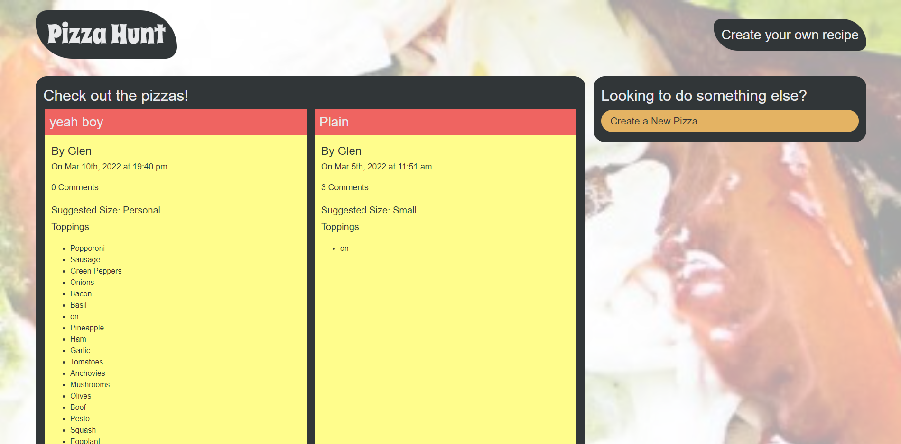
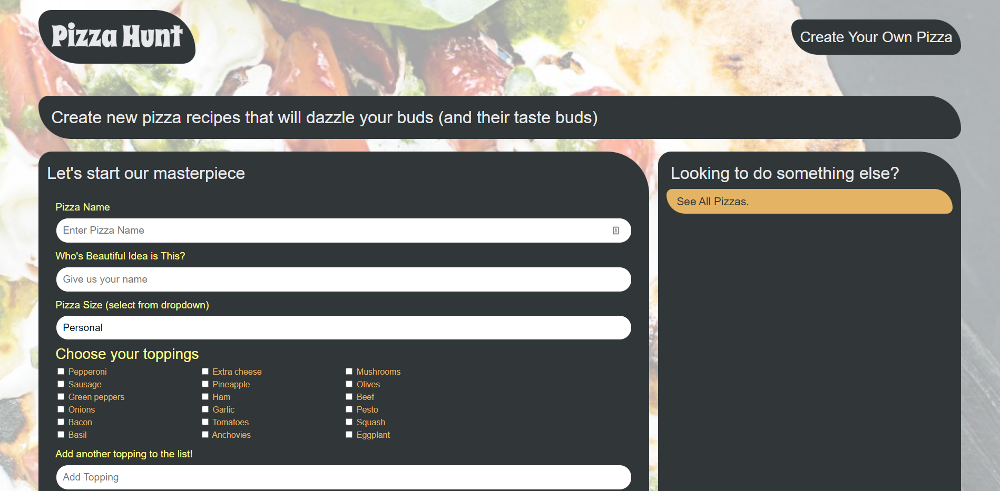
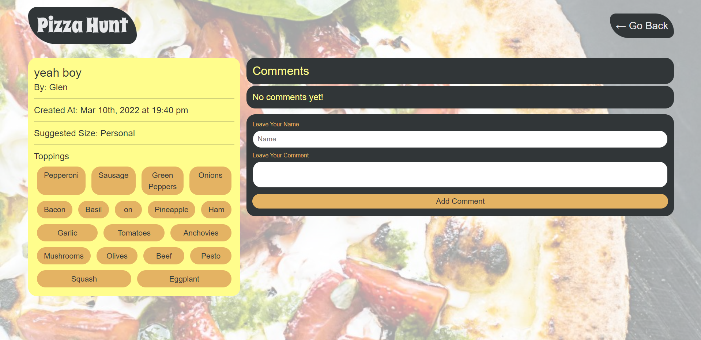

 </a>

<h3 align="center">Pizza Hunt</h3>

---

## 

- [About](#about)
- [Installing](#installing)
- [Usage](#usage)
- [Built With](#built_using)
- [Authors](#authors)
- [Questions](#questions)
- [Screenshots](#screenshots)

## 

Pizza Hunt is a class module designed to teach NoSQL.

## 

1. Clone repository
2. Run `npm install`
3. Run `npm start`
4. Navigate to localhost:3001

## 

Once you are at the website you are presented with all the pizza recipes. You may choose to create a pizza or "see the discussion". To create a pizza click on "create a new pizza" and fill out the form. Clicking on "see the discussion" an you will be able to leave comments on the pizza and reply to comments.

## 

- Node.js
- Express.js
- Mongodb
- Mongoose
- Javascript

## 

- [glenluersman](https://github.com/glenluersman)

## 

- Feel free to open an issue or contact me directly at glen.luersman@gmail.com if you have any questions about the repo. You can find more of my work at [glenluersman](https://github.com/glenluersman/).

## 

</a>

</a>

</a>
